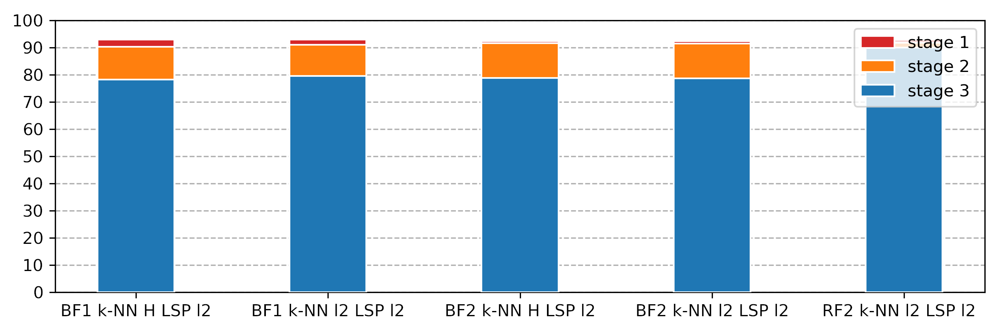

# Binary Graph Neural Networks
Code for our paper "Binary Graph Neural Networks", CVPR 2021

ArXiv: https://arxiv.org/abs/2012.15823


## Common code

binary.py: Contains implementations of quantizers, rescaling layers, and blocks to replace standard operations with binarized ones.

distillation.py: Implements cross-entropy with temperature and LSP.

## DGCNN



dgcnn/models_extended: code that implements the variants of binary DGCNN presented in the paper:
- BaseDGCNN: the model used in stage 1 that mimics the architecture of the binary networks but with floating point weights and activations and `tanh` activations
- BinDGCNN_RF: BinEdgeConv operator
- BinDGCNN_BF1: XorEdgeConv variant 1
- BinDGCNN_BF2: XorEdgeConv variant 2
- BinDGCNN_BF1_BAL: Adds optional mean and median centering between max/average pooling operations and quantization, used in the ablation study

dgcnn/models_common.py: Implementations of kNN search with the Euclidean and Hamming distances as well as some blocks specific to binarized DGCNN.

dgcnn_distill.py: Handles the cascaded distillation of DGCNN.
dgcnn_three_stage_distill: Bash script that automates the three-stage process with the parameters used in the paper.

## GraphSAGE

sage/binsage.py: Implementation of the binarized GraphSAGE convolutional layer

binsage_products_distill.py: Implements the three-stage cascaded distillation for training a binarized GraphSAGE network on the OGB-N Products benchmark. The architecture is the same as the one used in OGB for the floating-point GraphSAGE. **Note: The script does a single run to allow simple parallelisation of the runs** (i.e. we ran it 10 times in parallel and averaged the results rather than 10 times sequentially, due to the increased runtime of the three-stage training process).

binsage_products_scratch.py: Trains a binarized GraphSAGE from scratch on OGB-N Products, returns the averaged performance over 10 runs.

binsage_proteins_scratch.py: Trains a binarized GraphSAGE from scratch on OGB-N Proteins, returns the averaged performance over 10 runs.

## Coming soon


We intend to release our LARQ implementations (used for testing on a Raspberry Pi 4B) soon.

## Requirements

```Pytorch (last tested with Pytorch 1.8.1)
wandb
pytorch-geometric
torch-scatter
ogb
tqdm
h5py
numpy
scikit-learn
```

## Citation

Please cite our paper if you use this code

```
@inproceedings{bahri2020binarygnn,
      title={Binary Graph Neural Networks}, 
      author={Mehdi Bahri and Gaétan Bahl and Stefanos Zafeiriou},
      year={2021},
      booktitle={Proceedings of the IEEE/CVF Conference on 
    Computer Vision and Pattern Recognition (CVPR)},
      eprint={2012.15823},
      archivePrefix={arXiv},
      url={https://arxiv.org/abs/2012.15823},
      primaryClass={cs.LG}
}
```

## Licence

This code is made available under the terms of the MIT licence.

## Acknowledgements

Our DGCNN implementation is based on Yue Wang's original Pytorch implementation, available at https://github.com/WangYueFt/dgcnn/

Our GraphSAGE implementations are based on the code of the OGB project:
- https://github.com/snap-stanford/ogb/tree/master/examples/nodeproppred/products
- https://github.com/snap-stanford/ogb/tree/master/examples/nodeproppred/proteins